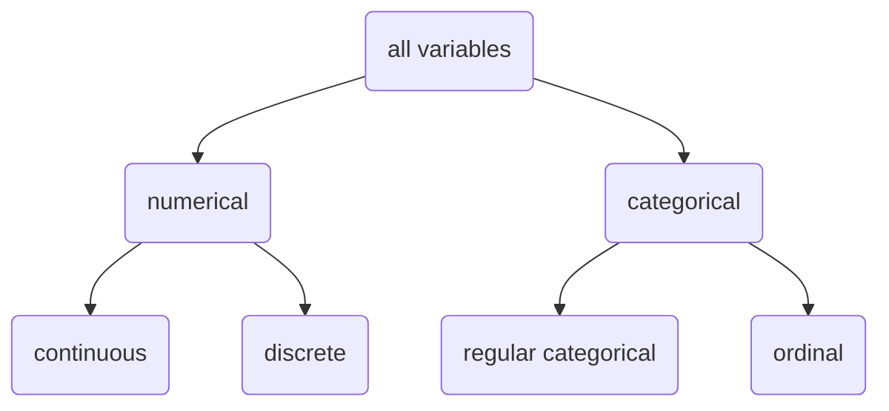

> [!info] Wed. 23.02.15

Statistics is about **dealing with the world of uncertainty**
- The event hasn't happened yet
	- What is the weather going to be like tomorrow?
	- Who will win the next election?
- The event happened, but we don't know the answer for sure
	- How many people were killed in World War II?
	- How many homeless people are there in Utrecht?

Simply put, statistics tries to answer these uncertain questions and uses numerical evidence to draw valid conclusions.

> Statistics is the science concerned with developing and studying methods for **collecting, analysing, interpreting** and **presenting** empirical data.

## 1 Course goals
1. The fundamental concepts in statistics and methods
2. Basic probabilistic reasoning skills
3. The Null Hypothesis Significance Testing framework
4. Inference for data
5. When and how to apply (what type of) statistical tests

## 2 Data Basics

### 2.1 Classroom survey
Suppose we conducted a survey. Below are some of the questions in the survey and the corresponding *variables* the data from the responses were stored in:
- **gender**: What is your gender?
- **intro/extra**: Are you an extravert or an introvert?
- **sleep**: How many hours do you sleep at night, on average?
- **bedtime**: What time do you usually go to bed?
- **countries**: How many countries have you visited?
- **dread**: On a scale of 1-5, how much do you dread being here?

We can represent the collected data using a **data matrix**:
![[data-matrix.png]]
### 2.2 Types of Variables
There are several types of variables:

Examples:
- Temperature is a **continuous numerical** variable - The quantity of the value has meaning, and the value can be fractional.
- Number of people is a **discrete numerical** variable - The quantity of the value has meaning, but the value has to be an integer.
- Name is a **regular categorical** variable - The quantity of the value is non-existent or has no meaning, and there is not a certain ordering.
- Education level is an **ordinal categorical** variable - The quantity of the value has no meaning, but there is a certain ordering.

> [!question] Practice
> What type of variable is a telephone area code?
> **a)** numerical, continuous
> **b)** numerical, discrete
> **c)** categorical
> **d)** categorical, ordinal
> > [!check]- Answer
> > c) categorical; The quantity has no meaning, and the ordering of codes is irrelevant.

